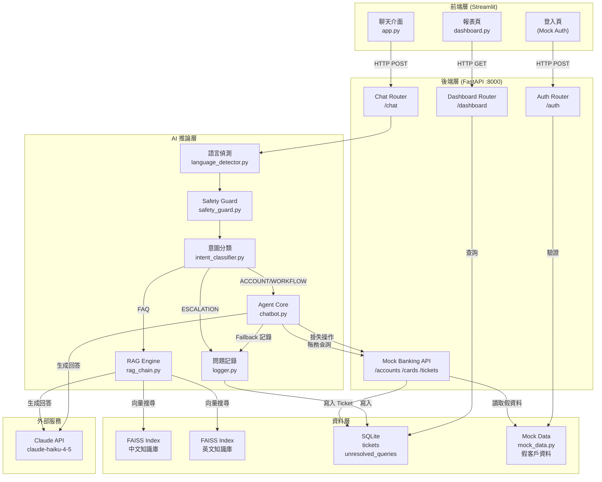

# Solution Architecture Document
# AI Banking Customer Assistant

| 欄位 | 內容 |
|------|------|
| **文件版本** | v1.0 |
| **建立日期** | 2026-07-06 |
| **依據文件** | PRD v1.0、Conversation Design v1.0 |

---

## 1. 架構總覽

本系統採用**分層架構**，分為前端展示層、後端服務層、AI 推論層、資料層四個層次。
作品集版本使用 Streamlit + FastAPI + SQLite，設計上保留可替換性，未來可升級至 Next.js + PostgreSQL + Docker。

---

## 2. 系統架構圖



---

## 3. 元件說明

### 3.1 前端層（Streamlit）

| 檔案 | 功能 | 關鍵元素 |
|------|------|---------|
| `frontend/app.py` | 主聊天介面 | `st.session_state`（對話記憶）、chat_input、message history |
| `frontend/dashboard.py` | 未解決問題報表 | Plotly 圖表、CSV 匯出按鈕 |

**Streamlit Session State 結構**：
```python
st.session_state = {
    "messages":        [],        # 對話歷史（最近 10 輪）
    "user_id":         None,      # 登入後的 user_id
    "authenticated":   False,     # 登入狀態
    "language":        "zh",      # 目前偵測語言
    "intent":          None,      # 目前意圖
    "workflow_step":   0,         # 掛失流程步驟
    "fallback_count":  0,         # 連續 Fallback 計數
    "session_id":      "uuid",    # 本次對話 ID
}
```

---

### 3.2 後端層（FastAPI）

FastAPI 自動生成 Swagger 文件，可於 `http://localhost:8000/docs` 存取。

#### Chat Router（`/chat`）

| Endpoint | Method | 說明 |
|----------|--------|------|
| `/chat` | POST | 接收用戶訊息，回傳 AI 回覆 |

**Request Body**：
```json
{
  "message": "信用卡年費多少？",
  "session_id": "abc-123",
  "user_id": null,
  "authenticated": false
}
```

**Response**：
```json
{
  "reply": "信用卡年費依卡別不同...",
  "intent": "credit_card_fee",
  "language": "zh",
  "source_doc": "credit_card_fees.md",
  "similarity_score": 0.87,
  "handoff_triggered": false
}
```

---

#### Auth Router（`/auth`）

| Endpoint | Method | 說明 |
|----------|--------|------|
| `/auth/login` | POST | Mock 登入驗證 |
| `/auth/verify-identity` | POST | 掛失流程身分驗證（身分證後四碼）|
| `/auth/logout` | POST | 登出，清除 session |

**Login Request**：
```json
{ "username": "user_001", "password": "demo1234" }
```

**Login Response**：
```json
{ "success": true, "user_id": "user_001", "name": "陳小明" }
```

---

#### Mock Banking API（`/accounts`、`/cards`、`/tickets`）

| Endpoint | Method | 說明 | 需登入 |
|----------|--------|------|--------|
| `/accounts/{user_id}/balance` | GET | 查帳戶餘額 | ✅ |
| `/accounts/{user_id}/bill` | GET | 查信用卡帳單 | ✅ |
| `/accounts/{user_id}/transactions` | GET | 查交易明細 | ✅ |
| `/cards/{card_id}/block` | POST | 執行信用卡掛失 | ✅ |
| `/tickets` | POST | 建立服務單 | ✅ |
| `/tickets/{ticket_id}` | GET | 查詢服務單狀態 | ✅ |

---

#### Dashboard Router（`/dashboard`）

| Endpoint | Method | 說明 |
|----------|--------|------|
| `/dashboard/unresolved` | GET | 取得未解決問題清單（含篩選、分頁）|
| `/dashboard/stats` | GET | 取得統計數字（總數、分類、語言）|
| `/dashboard/export` | GET | 匯出 CSV |

---

### 3.3 AI 推論層

#### 處理流程

```
用戶輸入
  │
  ▼
1. language_detector.py  → 偵測中/英文
  │
  ▼
2. safety_guard.py       → 是否為銀行相關問題？
  │ 否 → 友善拒絕
  │ 是 ↓
  ▼
3. intent_classifier.py  → 分類意圖（Claude prompt）
  │
  ├── FAQ      → 4. rag_chain.py → FAISS 搜尋 → Claude 生成
  ├── ACCOUNT  → 5. chatbot.py   → Mock API → Claude 整理
  ├── WORKFLOW → 5. chatbot.py   → 多步驟流程
  └── ESCALATION → logger.py + Human Handoff 回應
  │
  ▼
6. logger.py  → Fallback/Handoff 時寫入 SQLite
```

#### 各模組職責

| 模組 | 職責 | 關鍵邏輯 |
|------|------|---------|
| `language_detector.py` | 偵測輸入語言 | `langdetect` 套件；失敗預設中文 |
| `safety_guard.py` | 過濾非銀行問題 | 關鍵字黑名單 + Claude 判斷 |
| `intent_classifier.py` | 意圖分類 | Claude prompt 分類（結構化輸出）|
| `rag_chain.py` | FAQ RAG 查詢 | FAISS 搜尋 → Similarity 過濾 → Claude 生成 |
| `chatbot.py` | 對話核心 | 整合所有模組、管理對話記憶 |
| `logger.py` | 問題記錄 | Fallback/Handoff 時寫入 SQLite |

---

### 3.4 資料層

#### FAISS 知識庫

```
data/
└── knowledge_base/
    ├── zh/         ← 中文 Markdown FAQ 文件
    └── en/         ← 英文 Markdown FAQ 文件

faiss_index/        ← 執行期產生（不上傳 GitHub）
├── zh.index        ← 中文向量索引
├── zh_docs.pkl     ← 中文文件 chunks 對應表
├── en.index        ← 英文向量索引
└── en_docs.pkl     ← 英文文件 chunks 對應表
```

**向量化參數**：
- Chunk size：400 tokens
- Overlap：80 tokens
- Embedding model：`paraphrase-multilingual-mpnet-base-v2`
- Similarity threshold：0.7

---

#### SQLite 資料庫 Schema

**`tickets` 資料表**：
```sql
CREATE TABLE tickets (
    id          TEXT PRIMARY KEY,      -- T-YYYYMMDD-NNN
    created_at  DATETIME NOT NULL,
    user_id     TEXT,
    type        TEXT NOT NULL,         -- card_loss / complaint / general
    description TEXT,
    card_id     TEXT,
    status      TEXT DEFAULT 'open',   -- open / in_progress / closed
    priority    TEXT DEFAULT 'normal'  -- low / normal / high
);
```

**`unresolved_queries` 資料表**：
```sql
CREATE TABLE unresolved_queries (
    id            INTEGER PRIMARY KEY AUTOINCREMENT,
    created_at    DATETIME NOT NULL,
    session_id    TEXT,
    user_query    TEXT NOT NULL,       -- 用戶原始輸入
    language      TEXT,               -- zh / en
    intent        TEXT,               -- 分類到的意圖（或 unknown）
    trigger_reason TEXT NOT NULL,     -- low_similarity / handoff / api_failure
    similarity_score REAL             -- RAG 分數（若有）
);
```

---

## 4. 對話記憶設計

```python
# Rolling Window — 保留最近 10 輪
MAX_HISTORY = 10

def build_messages(history: list, user_input: str) -> list:
    messages = history[-MAX_HISTORY:]      # 最多保留 10 輪
    messages.append({
        "role": "user",
        "content": user_input
    })
    return messages
```

**Workflow State 獨立管理**（不佔用對話記憶）：
```python
# 掛失流程的狀態存在 session_state，不放入 Claude messages
workflow_state = {
    "step": 1,
    "verified": False,
    "selected_card": None,
    "attempts": 0
}
```

---

## 5. 錯誤處理策略

| 失敗情境 | 處理層 | 用戶回覆 | 記錄 |
|----------|--------|---------|------|
| Claude API timeout | chatbot.py | retry 1次；仍失敗→「系統暫時無法回應」| ✅ |
| Claude API rate limit | chatbot.py | 等待 2 秒後 retry；仍失敗→同上 | ✅ |
| FAISS 搜尋無結果 | rag_chain.py | Fallback 回覆 | ✅ |
| Mock API 失敗 | chatbot.py | 「帳務系統暫時無法存取」| ✅ |
| 語言偵測失敗 | language_detector.py | 預設中文，繼續處理 | ❌ |
| SQLite 寫入失敗 | logger.py | 靜默失敗（不影響主流程）| 寫 log 檔 |

---

## 6. 安全性設計

| 項目 | 設計 |
|------|------|
| API Key 保護 | 存於 `.env`，加入 `.gitignore`，絕不上傳 |
| GitHub 公開 | 僅上傳 `.env.example`，不含真實 key |
| Mock 資料 | 使用完全虛構的姓名、帳號，非真實個資 |
| Session 隔離 | 每個 Streamlit session 有獨立 session_id |
| 掛失確認 | 執行前要求明確輸入「確認掛失」，防止誤觸 |

---

## 7. 專案目錄結構（完整版）

```
ai-banking-assistant/
│
├── frontend/
│   ├── app.py                  # Streamlit 聊天主介面
│   └── dashboard.py            # 報表頁面
│
├── backend/
│   ├── main.py                 # FastAPI 入口
│   └── src/
│       ├── routers/
│       │   ├── chat.py         # /chat endpoint
│       │   ├── auth.py         # /auth endpoints
│       │   └── dashboard.py    # /dashboard endpoints
│       ├── mock_api/
│       │   ├── routes.py       # /accounts /cards /tickets
│       │   └── mock_data.py    # 假客戶資料
│       ├── rag/
│       │   ├── knowledge_base.py   # 文件載入、向量化
│       │   └── rag_chain.py        # FAISS 搜尋 + 生成
│       └── agent/
│           ├── language_detector.py
│           ├── safety_guard.py
│           ├── intent_classifier.py
│           ├── chatbot.py          # 對話核心
│           └── logger.py           # 問題記錄
│
├── data/
│   └── knowledge_base/
│       ├── zh/                 # 中文 FAQ Markdown
│       └── en/                 # 英文 FAQ Markdown
│
├── docs/
│   ├── PRD.md
│   ├── conversation_design.md
│   ├── user_flow.md
│   ├── architecture.md         # 本文件
│   ├── ADR.md                  # 技術決策紀錄
│   └── sprint_retros/          # 每個 Sprint 回顧
│
├── .env.example
├── .gitignore
├── requirements.txt
└── README.md
```

---

## 8. 生產環境升級路徑

| 作品集版本（現在）| 生產環境版本（面試時說明）|
|-----------------|----------------------|
| Streamlit | Next.js 14 |
| SQLite | PostgreSQL |
| 本地執行 | Docker Compose |
| 函式路由 | LangGraph Agent |
| FAISS 本地 | ChromaDB / Pinecone |
| Mock API | 真實 Core Banking API |
| 無 Rate Limiting | Redis + Rate Limiter |
| 無快取 | Redis FAQ 回答快取 |

---

*文件結束。下一步：ADR.md（技術決策紀錄）*
