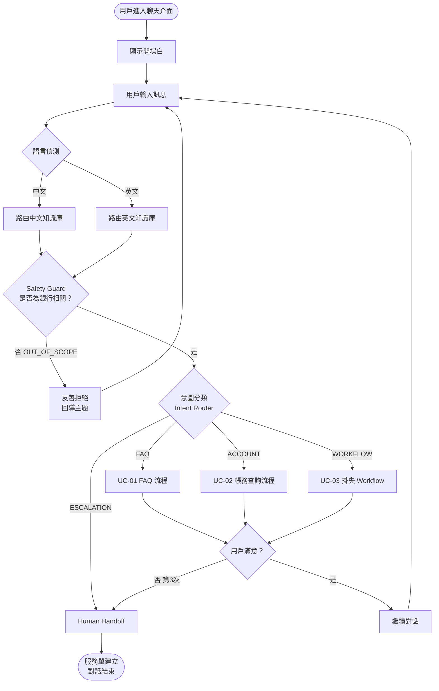
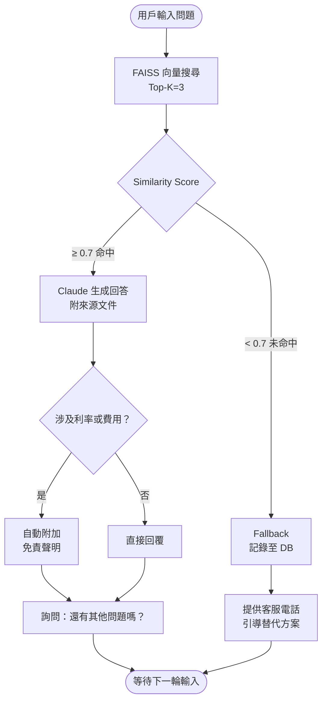
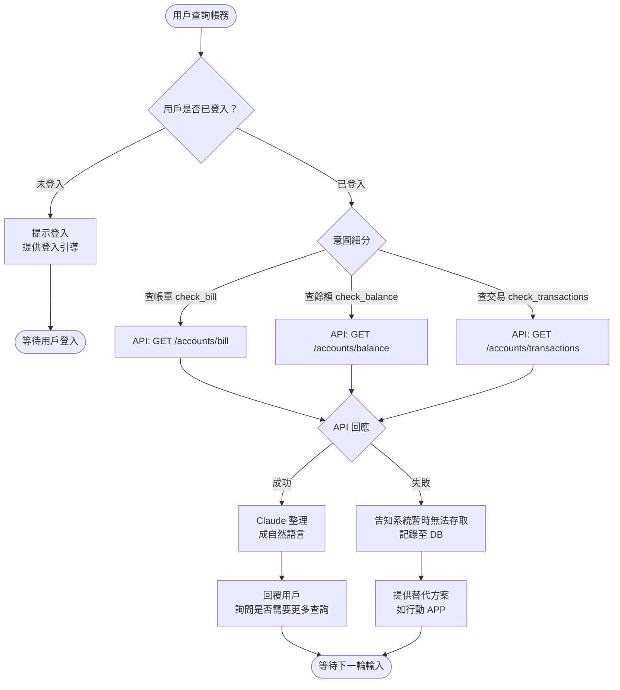
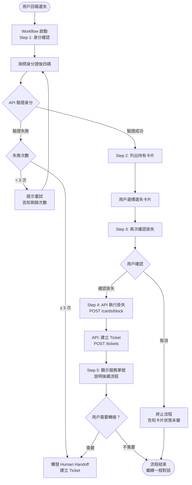
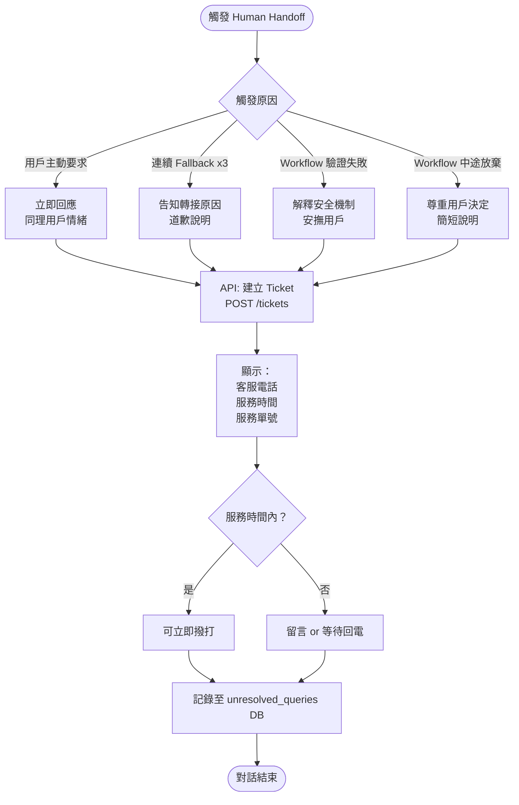
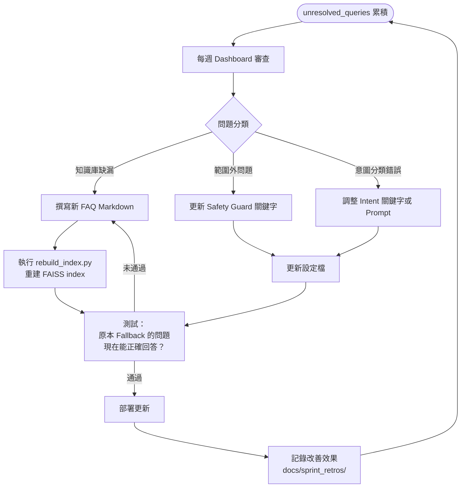
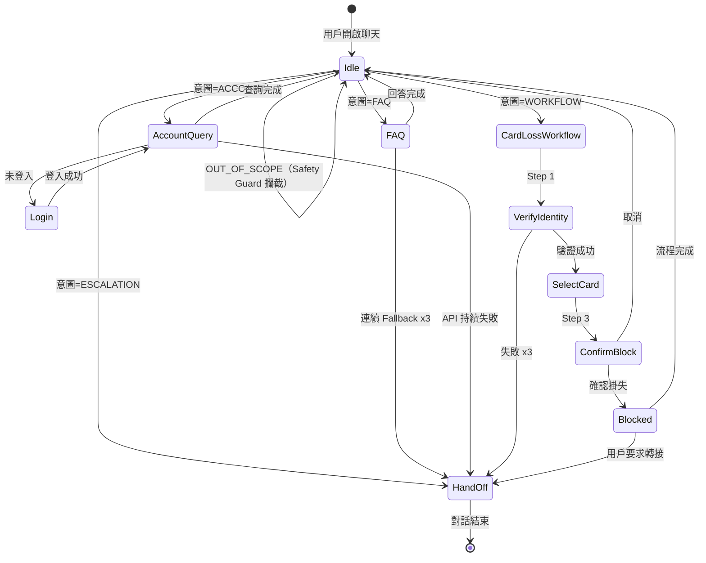

# User Flow Diagram
# AI Banking Customer Assistant

| 欄位 | 內容 |
|------|------|
| **文件版本** | v1.0 |
| **建立日期** | 2026-07-06 |
| **格式說明** | Mermaid 語法（可在 GitHub 或 mermaid.live 直接渲染） |

---

## 1. 整體系統流程

---

## 2. UC-01：FAQ 查詢流程

---

## 3. UC-02：帳務查詢流程

---

## 4. UC-03：信用卡掛失 Workflow

---

## 5. Human Handoff 流程

---

## 6. 知識庫更新維運流程

---

## 7. Session 狀態圖

---

*文件結束。下一步：Phase 3 Solution Architecture*
